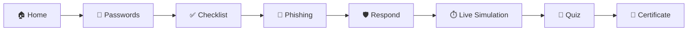

<div align="center">

# 🎯 RangeOps

### *Enter the range of opportunity.*

**Hands-on security practice and awareness training, right in your browser.**


[](https://rangeops.ca)
[](https://rangeops.ca/#/live)

[**Website**](https://rangeops.ca) · [**Live Simulation**](https://rangeops.ca/#/live) · [**Modules**](#-training-modules) · [**Run Locally**](#-run-locally) · [**Team**](#-the-team)

</div>

---

<!-- Add a screenshot or GIF of the site here:
<p align="center"></p>
-->

## 📖 About

> 🌐 **The site is live at [rangeops.ca](https://rangeops.ca).** Jump straight into the [live simulation](https://rangeops.ca/#/live).

**RangeOps** teaches people how to spot, handle and recover from common cyber threats through interactive practice instead of slide decks. Learners test password strength, work through a security checklist, sort phishing from legitimate email, respond to simulated ransomware outbreaks, and earn a certificate at the end.

It was built by four Durham College Computer Systems Technology graduates as a capstone project and won **Best Booth** at the **Durham College IT Student Expo 2026**.

Everything runs client-side in a single page. No accounts, no tracking, and nothing you type is ever sent anywhere.

## ✨ Features

| | Feature | What it does |
|---|---|---|
| 🔑 | **Password security** | Live strength meter with entropy estimate, plus a cryptographically random password generator |
| ✅ | **Security checklist** | 12 everyday habits with a progress bar, copy-to-clipboard and print support |
| 🎣 | **Spot the phish** | Judge real-looking emails and texts, with instant explanations of the red flags |
| 🛡️ | **Threat response** | Branching scenarios for ransomware, phishing and scam calls |
| ⏱️ | **Live simulation** | A timed inbox, followed by a ransomware outbreak that spreads in real time |
| 🧠 | **Knowledge quiz** | Five questions, scoring, and a printable certificate |
| 📚 | **Learn** | Incident steps, safe browsing tips, glossary, FAQ and trusted resources |
| 🌗 | **Light and dark themes** | Follows your system setting, with a manual toggle |

## 🧭 Training Modules



<details>
<summary><b>⏱️ How the live simulation works</b></summary>

<br>

👉 **[Try it now at rangeops.ca/#/live](https://rangeops.ca/#/live)**

**Part 1: The inbox.** Six emails arrive one at a time. You get 12 seconds to either *report as phishing* or mark as *looks safe*. Run out of time and it counts as a miss.

**Part 2: The outbreak.** Ransomware begins encrypting your files in real time. Choose containment actions before the bar hits 100%:

- ✅ Disconnect from the network (slows the spread)
- ✅ Call IT and report immediately (stops the spread)
- ✅ Warn coworkers to stay off shared drives
- ❌ Pay the ransom, delete the ransom note, or keep working (each makes things worse)

</details>

<details>
<summary><b>🛡️ Threat response scenarios</b></summary>

<br>

| Scenario | Steps | Key lesson |
|---|---|---|
| Ransomware | 4 | Isolate, report, preserve evidence, restore from clean backups |
| Phishing | 3 | Inspect, change credentials, enable MFA, report |
| Scam call | 3 | Never share passwords, verify the caller independently |

</details>

## 🚀 Run Locally

You don't need to install anything to use RangeOps. Just visit **[rangeops.ca](https://rangeops.ca)**. To run your own copy, there's no build step and no dependencies:

```bash
# Clone the repository
git clone https://github.com/<your-username>/rangeops.git
cd rangeops

# Open it in your browser
open index.html        # macOS
start index.html       # Windows
xdg-open index.html    # Linux
```

## 🌐 Live Demo

| | Link |
|---|---|
| 🏠 **Full site** | [rangeops.ca](https://rangeops.ca) |
| ⏱️ **Live simulation** | [rangeops.ca/#/live](https://rangeops.ca/#/live) |
| 🛡️ **Threat response** | [rangeops.ca/#/respond](https://rangeops.ca/#/respond) |
| 🧠 **Knowledge quiz** | [rangeops.ca/#/quiz](https://rangeops.ca/#/quiz) |

## 🗂️ Project Structure

```text
rangeops/
├── index.html      # The entire site: pages, styles and scripts
├── README.md       # You are here
└── docs/           # Screenshots (optional)
```

The pages are hash-routed inside one file (`#/passwords`, `#/checklist`, `#/phishing`, `#/respond`, `#/live`, `#/quiz`, `#/learn`, `#/team`), so there is no server or framework to set up.

## 🧰 Built With

- **HTML5, CSS3 and vanilla JavaScript**, with no frameworks or build tools
- **Web Crypto API** for secure random password generation
- **CSS custom properties** for light and dark theming
- **Space Grotesk** via Google Fonts for headings

## 🔒 Privacy

- Nothing you type into the password checker leaves your browser.
- There are no cookies, analytics or accounts.
- Even so, **don't test a password you actually use.**

## 👥 The Team

Four Durham College **Computer Systems Technology** graduates who built the original RangeOps as their capstone project.

| | Name | Role | Connect |
|---|---|---|---|
| 🔐 | **Aaron Jakus** | Global Cybersecurity Research Analyst, EH1-Infotech Cybersecurity | [LinkedIn](https://www.linkedin.com/in/aaron-jakus/) |
| 🖥️ | **Brandon Chhin** | IT Support Assistant, EQAO | [LinkedIn](https://www.linkedin.com/in/brandon-chhin/) |
| 🛠️ | **Tyirell Garraway** | Computer Systems Technology Graduate | [LinkedIn](https://www.linkedin.com/in/tyirell-garraway-4923a0226/) |
| ☁️ | **John Osso** | Aspiring IT Professional | [LinkedIn](https://www.linkedin.com/in/john-osso-77b8b8327/) |

## 🗺️ Roadmap

- [x] Password strength checker and generator
- [x] Security checklist
- [x] Phishing drills
- [x] Threat-response scenarios
- [x] Live ransomware simulation
- [x] Quiz and certificate
- [ ] More threat scenarios (lost devices, business email compromise)
- [ ] Escalating difficulty in the live simulation
- [ ] Persistent progress tracking
- [ ] Shared leaderboard
- [ ] Team photos

## 📄 License

License [MIT](https://choosealicense.com/licenses/mit/).

---

<div align="center">

**🎯 Enter the range of opportunity.**

[**Visit rangeops.ca →**](https://rangeops.ca)

Made by the RangeOps team · Durham College · 2026

</div>
